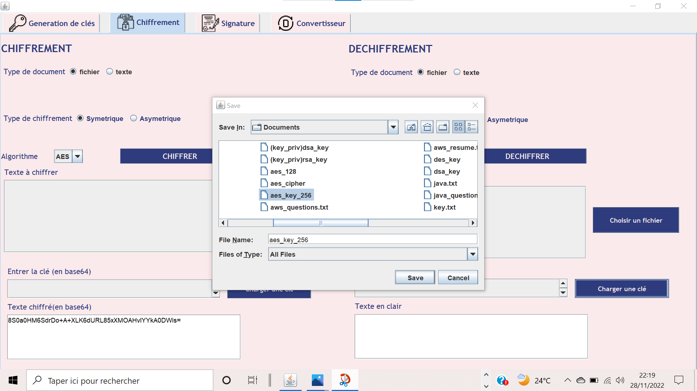

# CryptoJava

An cryptography software based on Java Swing 


[](https://github.com/GalsenDev221/made.in.senegal)

## Installation

You must have jdbc mysql connector and create database(cryptojava) with this command at the root of project.

```bash
database credentials
database name : cryptojava
root password : Ir00t@dmin12
```

you can change it,it's in [ConnexionDb file](./src/ahmadouBambaDiagne/bdd/ConnexionDB.java)

```bash
mysql -u username -p cryptojava < cryptojava.sql
```

## Usage

With this tool, you can generate your own keys,crypt text or document,sign text or document.You can also convert your keys file or document to base64 string.

## Project parts

#### Account creation

In this part ,you need to create account to access others parts of app

<span style="display:block">


Click on signup(inscription) button and then create account

<br/><br/>

<br/><br/>

After create account ,you can login into system and have access to others parts

<br/><br/>
<br/><br/>

#### Views of differents features of apps

<br/><br/>

#### Key Generation

In this part,you will be able to generate symetrics key(AES,DES) and asymetric keys(RSA,DSA).

##### Symetric key

For example ,generate AES 256 key size process
<br/><br/>

<br/><br/>
<br/><br/>
<br/><br/>

It's same process for asymetric key generation

#### Encryption/Decryption

In this part,you will be able to encrypt or decrypt documents or text with symetrics algorithm(AES,DES) and asymetric algorithm(RSA).


Ok,in this example i will encrypt an text file with symetric algorithm
<br/><br/>
<br/><br/>
<br/><br/>
<br/><br/>

Decrypt process

<br/><br/>

<br/><br/>

<br/><br/>

<br/><br/>

<br/><br/>

<br/><br/><br/><br/>

#### Signature/Verification

In this part,you will be able to sign documents or verify documents, texts signature with some algorithms(SHA256WITHRSA,DSA).<br/><br/>

In this example,I will sign an text file with SHA256WITHRSA with private key.

<br/><br/>
<br/><br/>
<br/><br/>  
<br/><br/>

<br/><br/>

After,we can verify file signature with public key.
<br/><br/>
<br/><br/>
<br/><br/>  
<br/><br/>

<br/><br/>

<br/><br/>

## Contributing

Pull requests are welcome. For major changes, please open an issue first
to discuss what you would like to change.

Please make sure to update tests as appropriate.

## License

[MIT](https://choosealicense.com/licenses/mit/)
